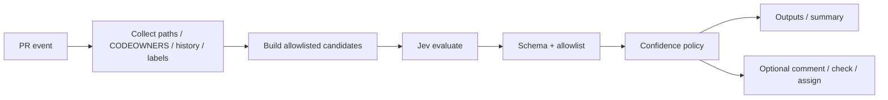

# JEV Reviewer Navigator

Suggest the right pull request reviewers from **CODEOWNERS**, commit history, changed paths, components, labels, and teams. **Jev** makes the typed decision; the Action only executes allowlisted effects.

Default mode is **recommend only**. Assignment is optional and explicit.

## Features

- Collects changed paths (PR files or input) and parses CODEOWNERS (last-match-wins)
- Merges allowlist + label→team map + component map; excludes the PR author
- Asks Jev via `vercel-ai-gateway` (default), `typesafe-native`, or `custom-compatible`
- Strict Zod decision contract: `suggested_reviewers`, `confidence`, `reason_codes`, `summary`
- Optional PR comment, check run, and `requestReviewers` assignment
- Soft signals: org membership availability and open review-request load
- Deterministic CODEOWNERS/history fallback when Jev is unavailable (`provisional=true`)

## How it works



## Quick Start

```yaml
- uses: JevForge/jev-reviewer-navigator@v0
  with:
    decision_only: 'true'
    dry_run: 'true'
  env:
    AI_GATEWAY_API_KEY: ${{ secrets.AI_GATEWAY_API_KEY }}
```

See [`examples/basic.yml`](examples/basic.yml) and [`examples/assign.yml`](examples/assign.yml).

## Inputs

| Input | Default | Description |
|-------|---------|-------------|
| `config_path` | `.jev/reviewer-navigator.yml` | Allowlist, maps, max reviewers |
| `changed_paths` | _(event)_ | Override path list |
| `codeowners_path` | `CODEOWNERS` | Preferred CODEOWNERS location |
| `allowlist` | _(config)_ | Extra users / `team:slug` |
| `exclude_author` | `true` | Drop PR author |
| `max_reviewers` | `3` | Cap suggestions |
| `jev_provider` | `vercel-ai-gateway` | No silent fallback |
| `jev_model` / `jev_endpoint` | | Native/custom requirements |
| `min_confidence` | `0.6` | Floor for trusted recommend |
| `low_confidence_policy` | `warn` | `fail` / `warn` / `request-review` / `no-op` |
| `decision_only` | `true` | Block assignment |
| `assign_reviewers` | `false` | Explicit assign opt-in |
| `auto_assign` | `false` | Document always-on assign |
| `consider_availability` | `false` | Soft org-membership signal |
| `consider_review_load` | `false` | Soft open review-request counts |
| `dry_run` | `true` | No mutate / no fail-on-policy |

## Outputs

| Output | Description |
|--------|-------------|
| `decision` | `RECOMMEND_REVIEWERS` / `ABSTAIN` / `REQUEST_REVIEW` |
| `suggested_reviewers` | JSON array of logins / `team:slug` |
| `ranked_reviewers` | Preference order |
| `confidence` | 0..1 |
| `reason_codes` | Stable enums |
| `summary` | Plain text (never execute) |
| `provisional` | Deterministic / policy path |
| `assign_status` | `requested` / `dry-run` / `skipped` / `disabled` |
| `availability_status` | `collected` / `skipped` / `unavailable` |
| `load_metrics` | JSON map of open review requests |

## Permissions

Recommend-only:

```yaml
permissions:
  contents: read
  pull-requests: read
  checks: write   # if create_check_run
```

With assignment or comments:

```yaml
permissions:
  contents: read
  pull-requests: write
  checks: write
```

## Decision model

Jev answers one boolean per allowlisted candidate plus `abstain` / `request_review`. The executor:

1. Validates the Zod schema
2. Intersects suggestions with the candidate allowlist
3. Caps to `max_reviewers`
4. Applies `min_confidence` + `low_confidence_policy`
5. Optionally assigns **only** when `decision_only=false` and `assign_reviewers=true`

See [`docs/decision-contract.md`](docs/decision-contract.md).

## Data Sent to JEV

- Sample of changed paths (not file contents)
- PR labels
- Candidate ids with boolean evidence flags (CODEOWNERS hit, history, label, component, availability, load)
- `max_reviewers` and an untrusted-data note

Never sent: tokens, secrets, patch hunks, raw CODEOWNERS file text beyond owner ids already on candidates.

## Auth

| Provider | Credential | Notes |
|----------|------------|-------|
| `vercel-ai-gateway` | `AI_GATEWAY_API_KEY` | Default model `typesafe-ai/jev` via `experimental_evaluate` |
| `typesafe-native` | `TYPESAFE_API_KEY` | Requires `jev_model` |
| `custom-compatible` | `JEV_CUSTOM_API_KEY` | Requires HTTPS `jev_endpoint` + `jev_model` |

## Troubleshooting

| Symptom | Check |
|---------|--------|
| Empty suggestions | Allowlist / CODEOWNERS / author exclusion |
| `provisional=true` | Jev unavailable or deterministic fallback |
| `assign_status=disabled` | `decision_only` still true |
| Schema rejected | Provider returned ids outside allowlist |

## Development

```bash
npm ci
npm run all
```

## License

MIT © JevForge
