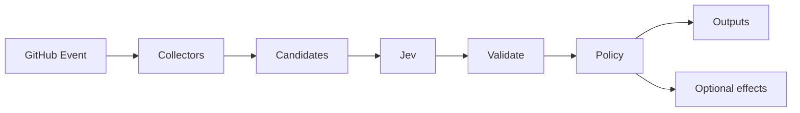

# JEV Reviewer Navigator

[](https://github.com/JevForge/jev-reviewer-navigator/releases)
[](LICENSE)
[](https://github.com/JevForge/jev-reviewer-navigator/actions/workflows/ci.yml)
[](https://nodejs.org/)

**Suggest the right pull request reviewers** from CODEOWNERS, commit history, changed paths, components, labels, and teams — using [TypeSafe Jev](https://vercel.com/ai-gateway/models/jev) as a typed decision layer inside GitHub Actions.

Wrong or missing reviewers slow every PR. Letting an unconstrained model invent `@mentions` is unsafe. This Action builds an **allowlisted** candidate set from your evidence, asks Jev which candidates fit the change, then applies deterministic policy a model cannot bypass. Default mode is **recommend only**; assignment is optional and explicit.

```yaml
- id: reviewers
  uses: JevForge/jev-reviewer-navigator@v0
  env:
    AI_GATEWAY_API_KEY: ${{ secrets.AI_GATEWAY_API_KEY }}
```

## Features

* Typed reviewer selection powered by Jev (`experimental_evaluate`, not free-form generation)
* Secret-based authentication (`AI_GATEWAY_API_KEY`, `TYPESAFE_API_KEY`, or `JEV_CUSTOM_API_KEY`)
* Structured outputs for later steps (`decision`, `suggested_reviewers`, `confidence`, …)
* CODEOWNERS (last-match-wins), path history, labels, and component maps as evidence
* Allowlist enforcement — unknown reviewers are never suggested or assigned
* Safe failure policies: `fail` | `warn` | `request-review` | `no-op`
* Optional PR comment, Check Run, and `requestReviewers` (gated behind explicit inputs)
* Soft signals for org membership and open review-request load (never invents OOO/busy)
* Deterministic CODEOWNERS/history fallback when Jev is unavailable (`provisional=true`)
* Deterministic required-reviewer floors by path (`required_reviewers`)
* Monorepo project evidence via `affected_projects` or Pathfinder-compatible `monorepo_plan`
* Explicit `primary_reviewer` output and a checkout-plus-Action composite wrapper
* `dry_run` (default `true`) — set `false` only when you want mutate/fail behavior

## How it works

```text
Pull request / changed paths
        ↓
Collect CODEOWNERS, history, labels, maps
        ↓
Build allowlisted candidates (exclude author)
        ↓
Jev evaluates each candidate (typed booleans)
        ↓
Schema validation + allowlist + confidence policy
        ↓
Outputs (suggested_reviewers, decision, …)
        ↓
Optional comment / check / assign
```



1. Load allowlist and maps from `.jev/reviewer-navigator.yml` (and optional inputs).
2. Collect changed paths from the PR (or `changed_paths`).
3. Parse CODEOWNERS and optional commit history / labels / soft signals.
4. Call Jev through `jev_provider` (no silent provider fallback).
5. Validate the response; drop ids outside the candidate allowlist; cap to `max_reviewers`.
6. Emit outputs. Free-form `summary` text is display-only and must never be executed.

## Demo

```text
Pull Request touches src/auth/login.ts
        ↓
CODEOWNERS → @bob, team:security
History → alice often commits here
Allowlist → alice, bob, team:security, team:platform
        ↓
Jev → recommend bob + team:security
        ↓
decision = RECOMMEND_REVIEWERS
suggested_reviewers = ["bob","team:security"]
        ↓
Workflow comments / optionally assigns (if enabled)
```

## Why JEV?

Jev is the **decision engine**, not a chat model in this Action. Reviewer Navigator asks one boolean question per allowlisted candidate (plus abstain / request-review). That returns a typed multi-select instead of prose you would have to parse or trust as shell.

The deterministic executor still owns the effect: allowlist intersection, author exclusion, `max_reviewers`, and `low_confidence_policy`. If Jev is down or the schema rejects the answer, the Action does not invent arbitrary `@users` — it follows policy, may use a provisional CODEOWNERS/history ranking, and marks `provisional=true`.

## Quick Start

1. Add a config file (see [`examples/.jev/reviewer-navigator.yml`](examples/.jev/reviewer-navigator.yml)). Protect it with CODEOWNERS; see [`examples/CODEOWNERS`](examples/CODEOWNERS).
2. Add repository secret `AI_GATEWAY_API_KEY` (default provider).
3. Add a workflow:

```yaml
name: Suggest reviewers
on:
  pull_request:

permissions:
  contents: read
  pull-requests: read

jobs:
  reviewers:
    runs-on: ubuntu-latest
    steps:
      - uses: actions/checkout@v4
      - id: nav
        uses: JevForge/jev-reviewer-navigator@v0
        with:
          decision_only: 'true'
          dry_run: 'true'
        env:
          AI_GATEWAY_API_KEY: ${{ secrets.AI_GATEWAY_API_KEY }}
      - name: Show suggestion
        run: |
          echo "decision=${{ steps.nav.outputs.decision }}"
          echo "reviewers=${{ steps.nav.outputs.suggested_reviewers }}"
```

## Complete Example

```yaml
name: Reviewer Navigator
on:
  pull_request:
    types: [opened, synchronize, reopened, ready_for_review]

permissions:
  contents: read
  pull-requests: write
  checks: write

jobs:
  suggest:
    runs-on: ubuntu-latest
    steps:
      - uses: actions/checkout@v4

      - id: nav
        uses: JevForge/jev-reviewer-navigator@v0
        with:
          decision_only: 'true'
          dry_run: 'true'
          comment_on_github: 'true'
          create_check_run: 'true'
          min_confidence: '0.6'
          low_confidence_policy: warn
          max_reviewers: '3'
        env:
          AI_GATEWAY_API_KEY: ${{ secrets.AI_GATEWAY_API_KEY }}

      - name: Gate on request-review
        if: steps.nav.outputs.needs_review == 'true'
        run: echo "Human review of reviewer selection is required"

      - name: Use JSON reviewers
        run: |
          echo '${{ steps.nav.outputs.suggested_reviewers }}' | jq .
```

Assign only when you explicitly opt in (`decision_only=false` + `assign_reviewers=true`). See [`examples/assign.yml`](examples/assign.yml).

## Inputs

| Input | Required | Default | Description |
| ----- | -------- | ------- | ----------- |
| `config_path` | no | `.jev/reviewer-navigator.yml` | Allowlist, component map, label→team map |
| `changed_paths` | no | _(from PR)_ | Override path list (newline or JSON array) |
| `codeowners_path` | no | `CODEOWNERS` | Preferred CODEOWNERS location |
| `allowlist` | no | _(config)_ | Extra users / `team:slug` |
| `exclude_author` | no | `true` | Drop the PR author |
| `max_reviewers` | no | `3` | Cap suggestions (1–16) |
| `labels` | no | _(from PR)_ | Label evidence override |
| `affected_projects` | no | | Newline-separated list or JSON array of affected monorepo projects |
| `monorepo_plan` | no | | JSON object from Monorepo Navigator; reads `affected_projects` |
| `jev_provider` | no | `vercel-ai-gateway` | `vercel-ai-gateway` \| `typesafe-native` \| `custom-compatible` |
| `jev_model` | no | _(provider default)_ | Required for native/custom |
| `jev_endpoint` | no | | HTTPS endpoint for native/custom |
| `jev_timeout_ms` | no | `45000` | Provider timeout |
| `jev_config_path` | no | `.jev/config.yml` | Shared Jev defaults |
| `min_confidence` | no | `0.6` | Floor for trusted recommend |
| `low_confidence_policy` | no | `warn` | `fail` \| `warn` \| `request-review` \| `no-op` |
| `decision_only` | no | `true` | Block assignment |
| `assign_reviewers` | no | `false` | Explicit assign opt-in |
| `auto_assign` | no | `false` | Documents always-on assign |
| `consider_availability` | no | `false` | Soft org-membership signal |
| `consider_review_load` | no | `false` | Soft open review-request counts |
| `include_commit_history` | no | `true` | Path commit authors as evidence |
| `history_lookback` | no | `20` | Commits per path batch |
| `comment_on_github` | no | `false` | Idempotent PR comment |
| `create_check_run` | no | `false` | Completed Check Run |
| `telemetry` | no | `false` | Structured info log (no secrets) |
| `cache_decisions` | no | `false` | Restore/save typed decisions via Actions cache |
| `trust_repo_jev_endpoint` | no | `false` | Trust repo config endpoint with credentials |
| `token` | no | `${{ github.token }}` | GitHub API token |
| `dry_run` | no | `true` | No mutate / no fail-on-policy |

## Outputs

| Output | Description |
| ------ | ----------- |
| `decision` | `RECOMMEND_REVIEWERS` \| `ABSTAIN` \| `REQUEST_REVIEW` |
| `suggested_reviewers` | JSON array of allowlisted logins / `team:slug` |
| `ranked_reviewers` | Preference-ordered JSON array |
| `primary_reviewer` | First ranked reviewer, or empty |
| `confidence` | `0`–`1` |
| `reason_codes` | JSON array of stable enums |
| `summary` | Plain text (never execute) |
| `provisional` | `true` on deterministic/policy path |
| `needs_review` | `true` when request-review policy applied |
| `affected_paths` | JSON array of collected paths |
| `jev_provider` | Provider that was asked |
| `assign_status` | `requested` \| `dry-run` \| `skipped` \| `disabled` |
| `availability_status` | `collected` \| `skipped` \| `unavailable` |
| `load_metrics` | JSON map of open review-request counts |
| `cache_hit` | `true` when the typed decision was restored from Actions cache |

### Using outputs in conditions

```yaml
- name: Notify on abstain
  if: steps.nav.outputs.decision == 'ABSTAIN'
  run: echo "No safe reviewer subset"

- name: Require human when policy asks
  if: steps.nav.outputs.needs_review == 'true'
  run: exit 1
```

## Authentication

Store provider credentials as repository (or organization) secrets — never in workflow YAML committed to git.

```text
Repository → Settings → Secrets and variables → Actions → New repository secret
```

| Provider | Secret name | Notes |
| -------- | ----------- | ----- |
| `vercel-ai-gateway` (default) | `AI_GATEWAY_API_KEY` | Model defaults to `typesafe-ai/jev` |
| `typesafe-native` | `TYPESAFE_API_KEY` | Also set `jev_model` |
| `custom-compatible` | `JEV_CUSTOM_API_KEY` | Also set HTTPS `jev_endpoint` + `jev_model` |

```yaml
env:
  AI_GATEWAY_API_KEY: ${{ secrets.AI_GATEWAY_API_KEY }}
```

## Permissions

Recommend-only (default):

```yaml
permissions:
  contents: read
  pull-requests: read
```

With comments or assignment:

```yaml
permissions:
  contents: read
  pull-requests: write
```

With Check Runs:

```yaml
permissions:
  contents: read
  pull-requests: read # or write
  checks: write
```

## Decision model

See [`docs/decision-contract.md`](docs/decision-contract.md) for valid/invalid decision examples.

Jev answers one boolean per allowlisted candidate plus `abstain` / `request_review`. The executor:

1. Validates the Zod schema
2. Intersects suggestions with the candidate allowlist
3. Caps to `max_reviewers`
4. Applies `min_confidence` + `low_confidence_policy`
5. Optionally assigns **only** when `decision_only=false` and `assign_reviewers=true`

### Required reviewer policy

Add a deterministic floor to `.jev/reviewer-navigator.yml`:

```yaml
required_reviewers:
  - paths: [/src/auth/]
    any_of: [team:security, bob]
    min: 1
```

When a matching path is changed, at least `min` entries from `any_of` are kept in
the allowlisted recommendation, subject to `max_reviewers`. Invalid entries fail
early with a path-aware message; use `team:slug`, not `org/team`.

### Monorepos

Pass project evidence from a previous Navigator step:

```yaml
with:
  affected_projects: '["apps/web", "packages/auth"]'
```

Map projects to reviewers with `project_reviewer_map`. The mapping only adds
allowlisted candidate evidence; it never bypasses the allowlist.

### Composite wrapper

The optional wrapper checks out the consumer repository and re-exports the Action
outputs:

```yaml
- id: nav
  uses: JevForge/jev-reviewer-navigator/composite@v0
  with:
    config_path: .jev/reviewer-navigator.yml
```

## Data sent to Jev

* Sample of changed paths (not file contents)
* PR labels
* Candidate ids with boolean evidence flags (CODEOWNERS, history, label, component, monorepo, availability, load)
* `max_reviewers` and an untrusted-data note

Never sent: tokens, secrets, patch hunks, or raw file contents.

## Security

* Paths, CODEOWNERS owners, labels, and commit metadata are **untrusted** input
* Only allowlisted reviewer ids can appear in outputs or assignment
* `summary` must never be passed to a shell as a command
* Repository `jev_endpoint` does not receive credentials unless `trust_repo_jev_endpoint=true`
* See [`SECURITY.md`](SECURITY.md) for private vulnerability reporting

## Troubleshooting

| Symptom | Check |
| ------- | ----- |
| Empty suggestions | Allowlist / CODEOWNERS / author exclusion |
| `provisional=true` | Jev unavailable or deterministic fallback |
| `assign_status=disabled` | `decision_only` still `true` |
| Schema rejected | Provider returned ids outside allowlist |
| Auth errors | Secret name matches provider (`AI_GATEWAY_API_KEY`, …) |

## Versioning

Prefer the floating major tag for consumers:

```yaml
uses: JevForge/jev-reviewer-navigator@v0
```

Pin a full release when you need reproducibility:

```yaml
uses: JevForge/jev-reviewer-navigator@v0.4.4
```

## Development

```bash
git clone https://github.com/JevForge/jev-reviewer-navigator.git
cd jev-reviewer-navigator
npm ci
npm run all   # typecheck + coverage + build
```

Commit updated `dist/` when `src/` changes. See [`CONTRIBUTING.md`](CONTRIBUTING.md).

## License

MIT © [JevForge](https://github.com/JevForge)
