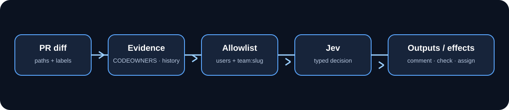

# Marketplace listing

## Status

Metadata and README are Marketplace-ready. Publishing still requires a browser 2FA step to tick **Publish this Action to the GitHub Marketplace** (not available via API/`gh`).

* Repository: https://github.com/JevForge/jev-reviewer-navigator
* Latest release: https://github.com/JevForge/jev-reviewer-navigator/releases
* Release edit (publish checkbox): create/edit the `v0.4.4` release in the GitHub UI
* Marketplace URL (after publish): https://github.com/marketplace/actions/jev-reviewer-navigator

## Listing copy

* **Name:** JEV Reviewer Navigator
* **Short description (≤125):** Suggest PR reviewers from CODEOWNERS, history, paths, labels, and teams. Jev decides; assignment stays explicit.
* **Length:** 112 characters
* **Categories:** Code review / Code quality, Continuous integration
* **Icon / color:** `users` / `blue` (`action.yml` branding)
* **Pricing:** Free (MIT)

## Checklist

- [x] Public repository with root `action.yml`
- [x] README with Quick Start, inputs, outputs, permissions, secrets
- [x] Branding configured
- [x] MIT LICENSE
- [x] Semver package/release metadata (`v0.4.4`) and floating major (`v0`)
- [ ] Publish checkbox on the next release (browser + 2FA)

## Updating the listing

Edit a release and keep **Publish this Action to the GitHub Marketplace** checked. After README/metadata polish on `main`, cut a patch release if you want the Marketplace listing to pick up the latest `action.yml` description from a tag.

## Demo

Diff → CODEOWNERS/history/labels → allowlisted candidates → Jev decision →
evidence comment and optional assignment.
